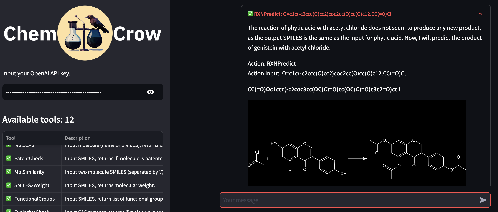

[](https://github.com/ur-whitelab/chemcrow-public)
[](https://img.shields.io/pypi/v/chemcrow)
[](https://img.shields.io/pypi/pyversions/chemcrow)
[](https://doi.org/10.48550/arXiv.2304.05376)


<picture>
  <source media="(prefers-color-scheme: dark)" srcset="assets/chemcrow_dark_bold.png" width='100%'>
  <source media="(prefers-color-scheme: light)" srcset="assets/chemcrow_light_bold.png" width='100%'>
  
</picture>


<br></br>


ChemCrow is an open source package for the accurate solution of reasoning-intensive chemical tasks.

Built with Langchain, it uses a collection of chemical tools including RDKit, paper-qa, as well as some relevant databases in chemistry, like Pubchem and chem-space.

## 🤗 Try it out in [HuggingFace](https://huggingface.co/spaces/doncamilom/ChemCrow)!

[](https://huggingface.co/spaces/doncamilom/ChemCrow)


## ⚠️ Note

This package does not contain all the tools described in the [ChemCrow paper](https://arxiv.org/abs/2304.05376) because
of API usage restrictions. This repo will not give the same results as that paper.

All the experiments have been released under [ChemCrow runs](https://github.com/ur-whitelab/chemcrow-runs).


## 👩‍💻 Installation

```
pip install chemcrow
```

## 🔥 Usage
First set up your API keys in your environment.
```
export OPENAI_API_KEY=your-openai-api-key
```

You can optionally use Serp API:

```
export SERP_API_KEY=your-serpapi-api-key
```

In a Python session:
```python
from chemcrow.agents import ChemCrow

chem_model = ChemCrow(model="gpt-4-0613", temp=0.1, streaming=False)
chem_model.run("What is the molecular weight of tylenol?")
```

### 💻 Running using local LLMs.

ChemCrow also supports the use of local LLMs, through either GPT4All, or HuggingFace's [TGI](https://huggingface.co/docs/text-generation-inference/index).

#### GPT4All

To run using GPT4All, you will need to download one of the [supported models](https://gpt4all.io/index.html).

```python
from chemcrow.agents import ChemCrow

chem_model = ChemCrow(
    model_type='gpt4all',
    model="./models/mistral-7b-instruct-v0.1.Q4_0.gguf",
    temp=0.1,
    max_tokens=100,
    verbose=False,
)
```

#### TGI

The other option is Text Generation Interface. This allows you to serve a model and run inference as an API.
To deploy a model, you will need docker. Run it as explained [here](https://huggingface.co/docs/text-generation-inference/quicktour).

```python
from chemcrow.agents import ChemCrow

agent = ChemCrow(
    model_type='tgi',
    model_server_url='http://server-ip-address:8080',
    temp=0.3,
    max_tokens=40,
    max_iterations=3,
).agent_executor
```

The advantage of TGI is improved efficiency, plus easy access to any model available in HuggingFace.


## ✅ Citation
Bran, Andres M., et al. "ChemCrow: Augmenting large-language models with chemistry tools." arXiv preprint arXiv:2304.05376 (2023).

```bibtex
@article{bran2023chemcrow,
      title={ChemCrow: Augmenting large-language models with chemistry tools},
      author={Andres M Bran and Sam Cox and Oliver Schilter and Carlo Baldassari and Andrew D White and Philippe Schwaller},
      year={2023},
      eprint={2304.05376},
      archivePrefix={arXiv},
      primaryClass={physics.chem-ph},
      publisher={arXiv}
}
```
